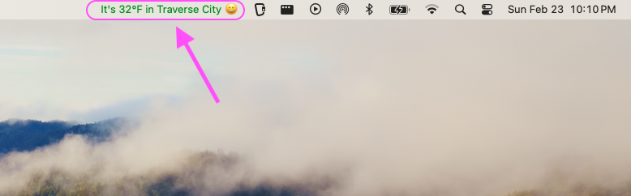
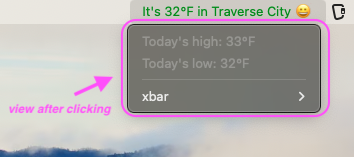

# Weather xbar App

This is an **xbar app** that shows the current weather for your city in the menu bar, changes the font color based on the temperature, and provides weather details when you click on the menu bar icon. You can also adjust the temperature thresholds for when you feel too cold or too hot.

---

---
## What is xbar?

[xbar](https://xbarapp.com/) is a macOS application that allows you to display custom scripts in your menu bar. With xbar, you can create and run your own scripts to display data, execute commands, or show any custom output from the macOS menu bar.

---

## Features of this App

- Displays the **current temperature** in your chosen city in the menu bar.
- Changes the **font color** based on the temperature:
  - **Blue** for cold temperatures (below the `COLD` threshold).
  - **Green** for comfortable temperatures (between the `COLD` and `HOT` thresholds).
  - **Red** for hot temperatures (above the `HOT` threshold).
- **Emojis** will also be displayed next to the temperature:
  - **🥶** for cold weather.
  - **😀** for comfortable weather.
  - **🥵** for hot weather.
- Shows **high and low temperatures** for the day when you click on the menu bar icon.
- You can **customize the city**, **cold**, and **hot** temperature thresholds through the xbar Preferences UI.
- Requires an **OpenWeather API key** to fetch weather data.

---

## Requirements

- **macOS**
- [xbar](https://xbarapp.com/) installed
- [Ruby](https://www.ruby-lang.org/en/) (usually pre-installed on macOS)
- An **OpenWeather API key** (you can sign up for a free API key [here](https://openweathermap.org/api))

---

## About OpenWeather API

The **OpenWeather API** provides access to current weather data, forecasts, and historical data from around the world. This app uses the **current weather API** to fetch data for a specified city. 

You can sign up for a free OpenWeather API key on their website:  
[OpenWeather API Signup](https://openweathermap.org/api)

Once you’ve signed up, you’ll receive an **API key** which is necessary to fetch weather data. This key allows your app to query the OpenWeather service and retrieve weather information such as current temperature, high and low for the day, and other related details.

- **API Endpoint**:  
  The app uses the endpoint `https://api.openweathermap.org/data/2.5/weather?q=#{city}&appid=#{API_KEY}&units=imperial` to retrieve weather data for a given city.
  
- **Units**:  
  This app uses the **imperial** unit system, which gives temperature readings in **Fahrenheit**. You can change this in the API settings if you prefer Celsius.

---

## Installation & Setup

1. **Install xbar:**
   - Download and install **xbar** from [https://xbarapp.com](https://xbarapp.com/).
   - After installation, launch **xbar** and it will appear as an icon in your macOS menu bar.

2. **Download or Clone the Repository:**
   - Clone this repository or download the script file to your computer.

3. **Add the Script to xbar:**
   - Move the Ruby script into your **xbar plugin folder**:
     - Open xbar's Preferences by clicking the xbar icon in your menu bar → "Preferences."
     - Go to the **Plugins** tab and click on "Open Plugins Folder."
     - Place the downloaded Ruby script into this folder.

4. **Set Your OpenWeather API Key:**
   - Obtain an API key from [OpenWeather](https://openweathermap.org/api).
   - In xbar, set the environment variable `OPEN_WEATHER_API_KEY`:
     - Go to **xbar Preferences** → **Variables** tab.
     - Add the variable `OPEN_WEATHER_API_KEY` with your API key as the value.

---

## Customizing Your City and Temperature Thresholds

You can customize the city and the temperature thresholds for cold and hot weather in the **xbar Preferences UI** 
(click on xbar in toolbar >> xbar >> open plugin...)

1. **Set the City:**
   - In the **xbar Variables** tab, find the `CITY` variable.
   - Change the value to the name of your preferred city (e.g., "New York", "Los Angeles", etc.).

2. **Set Temperature Thresholds:**
   - In the **xbar Variables** tab, find the `COLD` and `HOT` variables.
   - Set `COLD` to your comfortable temperature threshold for cold weather (e.g., `32` for freezing).
   - Set `HOT` to your comfortable temperature threshold for hot weather (e.g., `72` for a comfortable summer day).

---

## How to Use

1. **See Current Weather:**
   - After setting everything up, you will see the **current temperature** in your city displayed in your macOS menu bar.
   - The **font color** will change based on the current temperature:
     - **Blue** for cold temperatures (below the `COLD` threshold).
     - **Green** for comfortable temperatures (between the `COLD` and `HOT` thresholds).
     - **Red** for hot temperatures (above the `HOT` threshold).
   - An **emoji** will also be displayed:
     - **🥶** for cold temperatures.
     - **😀** for comfortable temperatures.
     - **🥵** for hot temperatures.

2. **Click for Detailed Information:**
   - Click on the **xbar menu bar icon** to see additional weather details:
     - **High and low temperatures** for the day will be shown.
   
   Example output when clicked:
   - **Menu bar display:**  
     "It’s 68°F in Traverse City 😀 | color=green"
   - **Detailed weather:**  
     "Today's high: 72°F"  
     "Today's low: 60°F"

---

## Troubleshooting

- **Weather information not showing?**
  - **Check your OpenWeather API key** in the xbar preferences and make sure it’s valid.
  - Ensure the **city name** is entered correctly in the xbar preferences.
  
- **Temperature thresholds not affecting the display?**
  - Double-check that **COLD** and **HOT** variables are set properly in the xbar preferences.

---

## License

This app is open source and free to use under the MIT license. Feel free to fork or modify it for your needs.